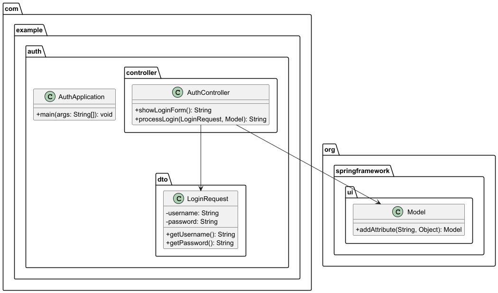

## Diagrama de Clases

```mermaid
classDiagram
    class AuthApplication {
        +main(args: String[]): void
    }

    class AuthController {
        +showLoginForm(): String
        +processLogin(LoginRequest, Model): String
    }

    class LoginRequest {
        -username: String
        -password: String
        +getUsername() String
        +getPassword() String
    }

    AuthController --> LoginRequest
    AuthController --> Model


### Para el diagrama de secuencia (como imagen):
```markdown
## Diagrama de Secuencia

